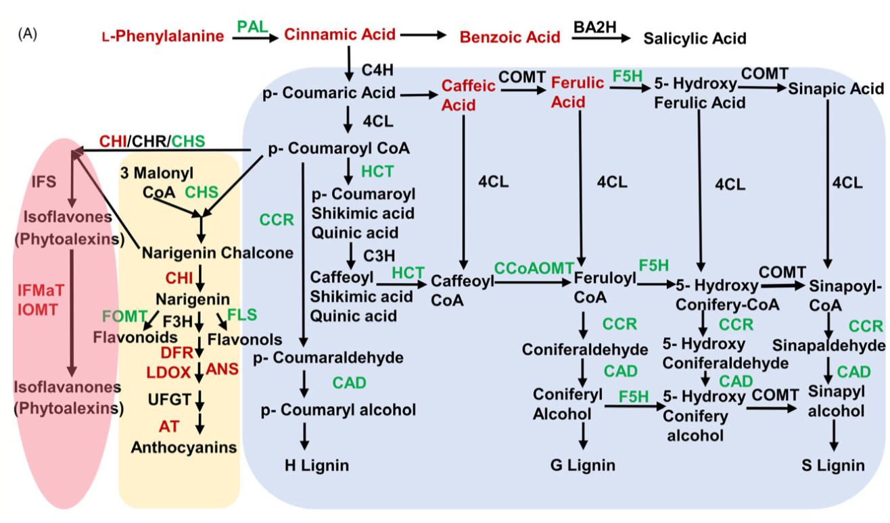

Most commercial soybean varieties are highly susceptible to _Sclerotinia sclerotiorum_, which causes the soybean disease known as Sclerotinia stem rot, or more commonly referred to as "white mold". A recent study by Ranjan et al ([2019](https://onlinelibrary.wiley.com/doi/full/10.1111/pbi.13082)) showed that two recombinant inbred soybean lines from the same parentage respond differently when inoculated with _Sclerotinia sclerotiorum_, showing either susceptible or resistant phenotypes. Interestingly, the resistant soybean line developed a strong "red stem" phenotype (pictured above). 

Comparing genetic responses between the two soybean lines indicated that a downregulation of genes in the phenylpropanoid pathway may be a key to mounting a resistance response. Additional metabolomics efforts showed that phenylpropanoid intermediates accumulated higher in the resistant line than the susceptible line. Finally, these phenylpropanoid intermediate compounds were shown to have anti-fungal activity, specifically targeting ergosterol biosynthesis.

My work is continuing on this project by identifying key genetic components of the phenylpropanoid pathway in soybean and using a gene silencing approach to knock down each phenylpropanoid gene candidate. Using this approach, I hope to validate the role of each gene in the phenylpropanoid pathway and identify targets that can be silenced to specifically lead to accumulating anti-fungal phenylpropanoid intermediates.  
