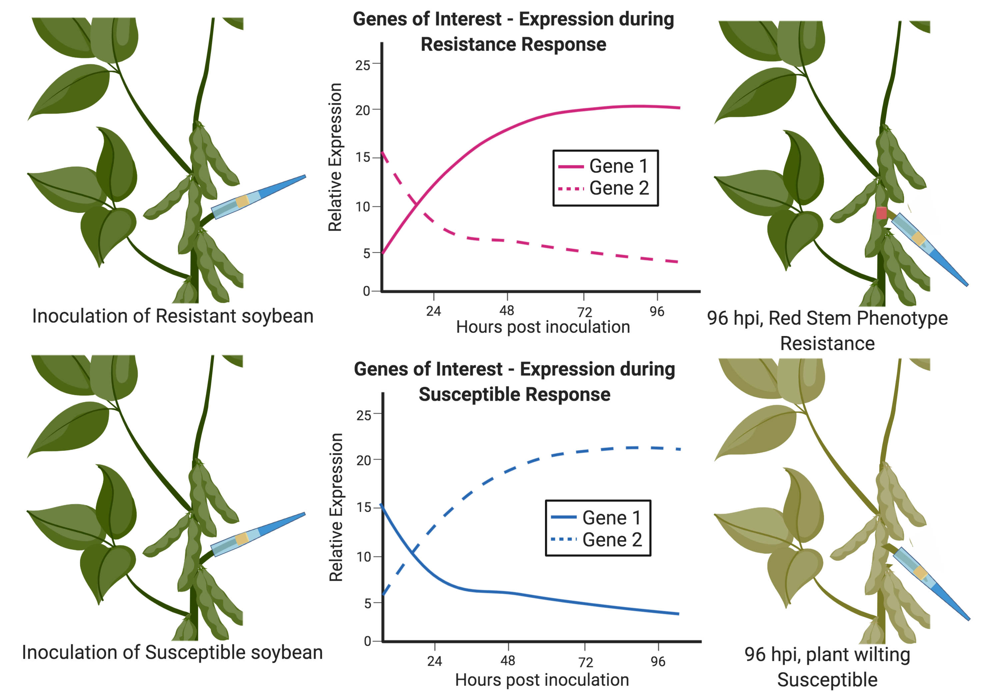
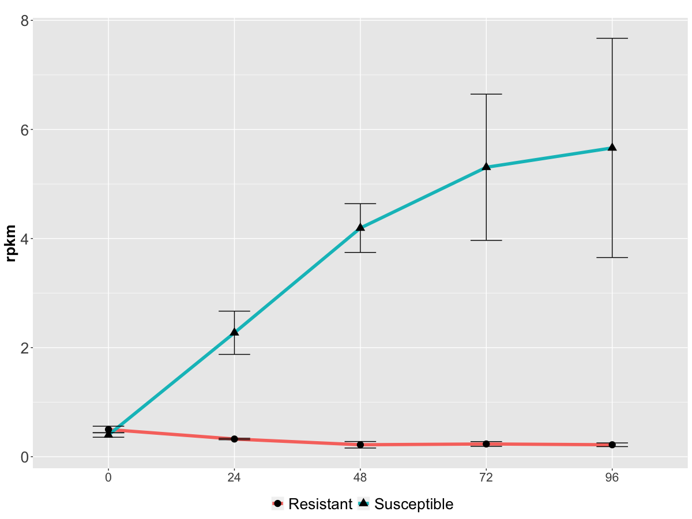

The plant immune system is considered to be innate rather than adaptive. Part of this innate immune system is the presence of membrane bound proteins that can recognize specific molecules in the surrounding environment. These genes go by many different names, but are most commonly referred to as R-genes, where "R" stands for either "resistance" or "receptor". When an R-gene recognizes certain molecules from plant pathogens, the R-gene can initiate defense signals to prevent the pathogen from infecting the plant. These defense signals often culminate in localized plant cell death - sacrificing part of the plant to save the whole organism. 

However, some fungal plant pathogens specifically feed on dead plant tissue. Therefore, plant cell death is exactly what the fungal pathogen wants. Therefore, some necrotrophic fungi purposely release molecules that can be recognzied by R-genes, triggering localized plant cell death. This concept is referred to as the inverse gene-for-gene model (pictured above). Key examples of this have been shown in two different fungal diseases of wheat; tan spot (Ciuffetti et al [2010](https://doi.org/10.1111/j.1469-8137.2010.03362.x)), and Stagonospora nodorum blotch (Friesen and Faris [2010](https://doi.org/10.1080/07060661003620896)).

Using a bioinformatics approach, I analyzed the transcriptomes of susceptible and resistant soybean lines over time after inoculation with _Sclerotinia sclerotiorum_. I am specifically interested in identifying genes that showed opposite trends between the two lines in response to fungal infection. Genes that increased in the resistant line with a corresponding decrease in the susceptible line may indicate that gene's role in resistance. Likewise, genes that increased in the susceptible line with a corresponding decrease in the resistant line may indicate that gene's role in susceptibility. A graphical abstract of this concept can be found below.

Identifying genes based on this trend resulted in many gene candidates. To narrow down the search, I included additional criteria involving overall expression levels and statistics. These criteria included 1) overall average expression level > 1 rpkm, 2) expression present in both susceptible and resistant lines, and 3) no significant difference at 0 hpi. These criteria allowed us to identify genes that have strong expression levels (1) that change significantly in opposite directions (2), specifically in response to _S. sclerotiorum_ (3). This narrowed the list of candidates down to 1 gene, an R-gene that increased significantly in the susceptible line, but went down and stayed very low in the resistant line. Using a combination of reverse genetics approaches, virus-induced gene silencing, transient expression, and yeast two hybrid, I hope to validate the role of this R-gene in triggering plant cell death and also identify the cognate S. sclerotiorum protein that activates this susceptibility gene. 

