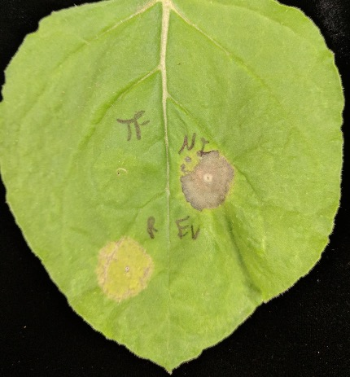

Microbes and plants interact by releasing recognizing different molecules. In plant pathology, pathogen-secreted molecules are often referred to as "effectors" because they effect plant physiology to establish an infection. However, pathogens also secrete factors that are not always classified as effectors, such as cell-wall degrading enzymes and secondary metabolites (reviewed in [Stergiopoulos and de Wit 2009](https://doi.org/10.1146/annurev.phyto.112408.132637)). Despite their categorization, the mechanisms by which pathogen-secreted molecules effect plants are very interesting to many researchers like me.

_Fusarium virguliforme_, causal agent of soybean sudden death syndrome (SDS) releases multiple effector proteins during infection ([Abeysekara et al 2014](https://doi.org/10.1371/journal.pone.0093667)). Two of these proteins, FvTox1 ([Brar et al. 2011](https://doi.org/10.1094/MPMI-12-10-0285)) and FvNIS1 ([Chang et al. 2016](https://doi.org/10.1094/MPMI-09-15-0219-R)), have been shown to play a role in chlorosis and necrosis, respectively. Using _Agrobacterium_-mediated heterologous expression in tobacco, I was able to show that FvNIS1 (NF) still induces necrosis in tobacco similar to the positive control (R), while FvTox1 (TF) does not induce chlorosis in tobacco, similar to the empty vector control (EV).  These results suggest that FvNIS1 may target a pathway conserved across soybean and tobacco to induce necrosis, while FvTox1 may target a soybean-specific pathway to induce chlorosis. Future work will incude co-immunoprecipitation to identify FvTox1- and FvNIS1-interacting proteins, which may reveal mechanisms of SDS symptom development. 
